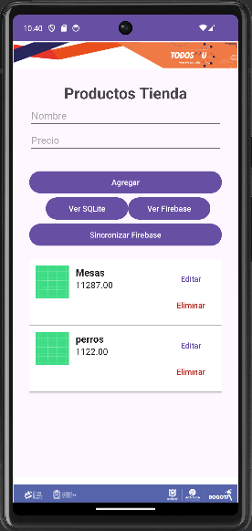

# Productos Tienda

| Descripción                                     | Imagen                                                     |
|-------------------------------------------------|-------------------------------------------------------------|
| Un ejemplo de sincronización entre una base de datos SQLite y un servicio en la nube con Firebase Realtime Database. El proyecto está desarrollado en Java y se implementa en una aplicación para Android Studio. |  |
